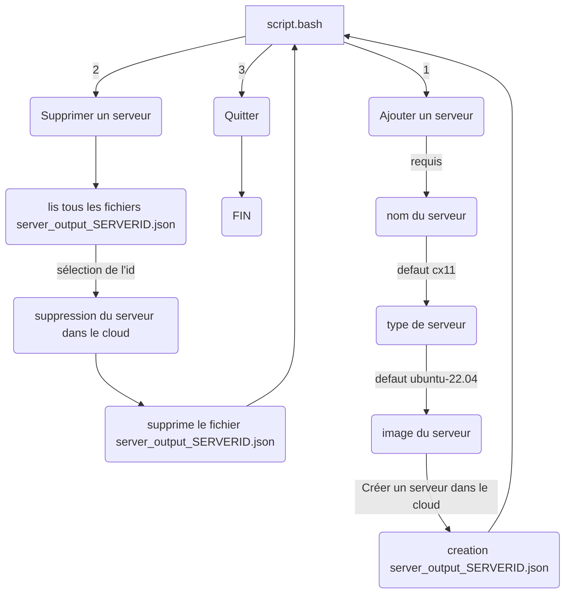

# Script API Hetzner

Ce script permet de déployer des serveurs sur le cloud hetzner en quelques secondes.


## Prérequis

```bash
sudo apt update && sudo apt install -y jq
# Ajout de la variable d'environnement API_TOKEN
export API_TOKEN="API TOKEN HETZNER"
```

## Lancement du script

```bash
bash script.bash
```
